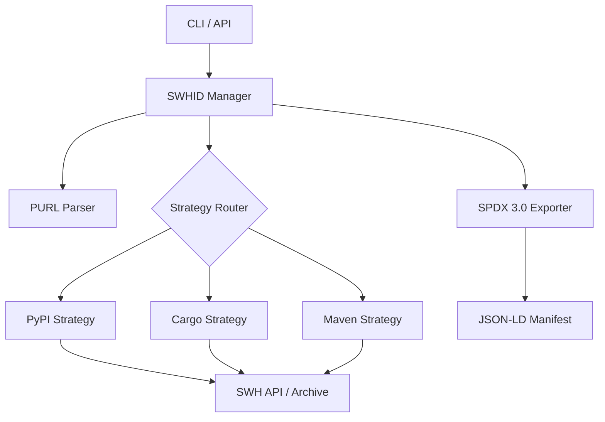

# SWHID Verification Tool

[](https://opensource.org/licenses/MIT)
[](https://www.python.org/downloads/)
[](https://www.softwareheritage.org/)

A verification framework designed to map Package URLs (PURLs) to verified Software Heritage Identifiers (SWHIDs). This tool ensures cryptographic and structural provenance by establishing a verifiable link between software distributions and their canonical source code archived in the Software Heritage (SWH) ecosystem.

## The Semantic Gap

In modern software development, we interact with dependencies using package-level identifiers (e.g., `lodash@4.17.21` or `requests@2.31.0`). However, these packages are mutable and vulnerable to supply chain tampering. 

To guarantee reproducibility and security, we need **cryptographic, content-addressed identifiers** like Software Heritage Identifiers (SWHIDs). Currently, there is a **semantic gap** between the package managers and the archive. This tool bridges that gap by automatically resolving package releases to verified SWHIDs across 6 major registries: **PyPI**, **npm**, **Cargo**, **Go Modules**, **Maven Central**, and **NuGet**.

## Dataset

We have generated a verified showcase dataset containing 25 of the most popular packages across all 5 ecosystems. The resulting **SPDX 3.0 JSON-LD** manifest is available at [`dataset/showcase_manifest.jsonld`](dataset/showcase_manifest.jsonld).

### Verification Statistics

| Metric | Count | Percentage |
| :--- | :--- | :--- |
| **Total Packages** | 25 | 100% |
| **Inferred (Medium Confidence)** | 18 | 72.0% |
| **Verified (High Confidence)** | 1 | 4.0% |
| **Partial (Low Confidence)** | 1 | 4.0% |
| **Errors/Failed** | 5 | 20.0% |

*Note: The "Inferred" status indicates that the repository was successfully matched and verified in the Software Heritage archive, but the specific version tag was not found in the latest snapshot. Running the tool with a Software Heritage API token resolves rate-limiting errors (HTTP 429) encountered during "Save Code Now" triggers.*

## Key Features

*   **Multi-Ecosystem Support**: Specialized verification strategies for **PyPI**, **npm**, **Cargo**, **Go Modules**, **Maven Central**, and **NuGet**.
*   **High-Confidence Provenance**:
    *   **PyPI**: Extraction of commit SHAs from Sigstore/PEP 740 attestations via Fulcio certificates.
    *   **Cargo**: Deterministic normalization and restoration of original project state for byte-for-byte matching.
    *   **Maven**: SCM metadata resolution and verification of cleaned source artifacts.
*   **OSV.dev Vulnerability Mapping**: Content-based vulnerability scanning. Maps resolved cryptographic commit SHAs (`swh:1:rev:...`) to known vulnerabilities in the OSV.dev database, eliminating false-negatives from package renaming/forks.
*   **CI/CD Gatekeeping Policy Engine**: Define compliance rules in `swhid-policy.toml` (e.g. minimum confidence levels, fail-on-vulnerabilities, fail-on-mismatch, allowlists) to automatically break builds in CI/CD pipelines.
*   **SPDX 3.0 Compliance**: Generation of RDF-compatible JSON-LD manifests using official SPDX models.
*   **Automated Archival Integration**: Proactive use of the Software Heritage "Save Code Now" API.
*   **Installation Verification**: Local filesystem scanner to audit installed package directories and files recursively against verified SWHID ground truth.

## Installation

### Prerequisites
- Python 3.9+
- [Optional] A Software Heritage API Token for higher rate limits.

### Setup
```bash
git clone https://github.com/OdysseasKalaitsidis/SWHID_POC
cd SWHID_POC
python -m venv venv
source venv/bin/activate  # Use .\venv\Scripts\activate on Windows
pip install -r requirements.txt
```

## Configuration

The tool can be configured via environment variables or a `.env` file:

| Variable | Description | Default |
| :--- | :--- | :--- |
| `SWH_TOKEN` | Software Heritage API Authentication Token | None |
| `CACHE_DIR` | Directory for caching resolution results | `./cache` |
| `LOG_LEVEL` | Logging verbosity (DEBUG, INFO, ERROR) | `INFO` |

## Usage

### Quick Start
Map a single PURL to a verified SWHID immediately:
```bash
python -m swhid_tool.cli swhid-map pkg:pypi/six@1.17.0
```

### Batch Processing
Generate an SPDX 3.0 dataset for multiple PURLs:
```bash
python -m swhid_tool.cli batch-process input_purls.txt output_report.jsonld
```

### Integrity Auditing
Verify a local directory against a verified manifest:
```bash
python -m swhid_tool.cli verify-path /path/to/installed/library manifest.jsonld
```

### REST API (Experimental)
Deploy as a service using FastAPI:
```bash
python -m uvicorn swhid_tool.api:app --host 0.0.0.0 --port 8000
```

## Architecture

The system utilizes a strategy-based pattern to decouple ecosystem-specific logic from the core resolution engine.



## Validation and Standards

Verification findings are exported as SPDX 3.0 documents. Compliance with RDF standards is ensured through SHACL shape validation using the integrated `test_validation.py` suite.

## Documentation

Detailed guides for different stakeholders:
- [**User Guide**](user_guide.md): CLI reference, API specifications, and troubleshooting.
- [**Developer Guide**](developer_guide.md): Extending the tool to new ecosystems and core internals.
- [**Maintainer Guide**](maintainer_guide.md): Best practices for enabling high-confidence verifiability.

## Contributing

Contributions are welcome! Please see the [Developer Guide](developer_guide.md) for setup instructions and coding standards.

## License

This project is licensed under the MIT License - see the [LICENSE](LICENSE) file for details.

## Acknowledgments

This project was independently developed, inspired by a GSoC proposal for [Software Heritage](https://www.softwareheritage.org/). The [SWHID standard (ISO/IEC 18670:2025)](https://swhid.org) and the Software Heritage archive are projects of [Inria](https://www.inria.fr/).
