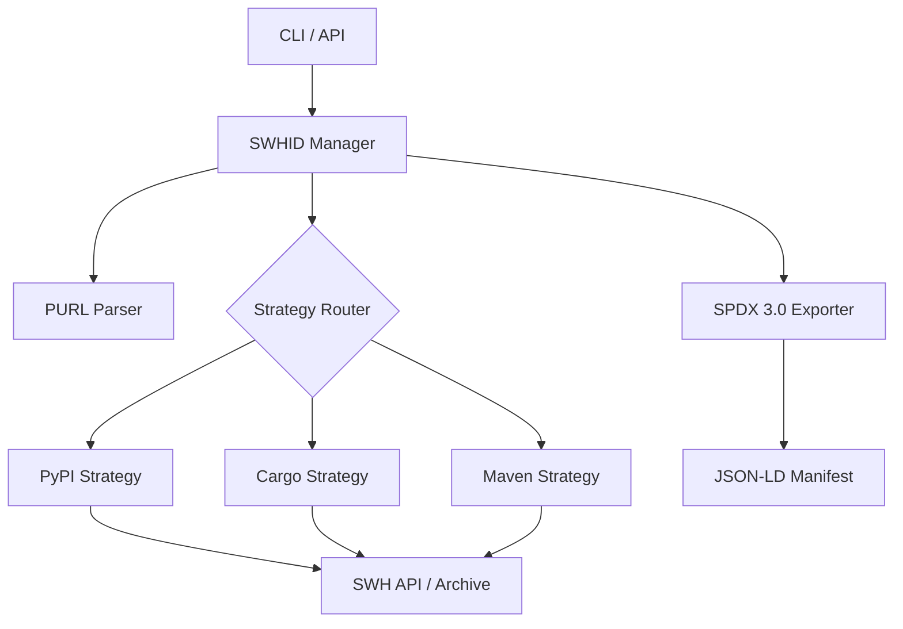

# SWHID Verification Tool

[](https://summerofcode.withgoogle.com/)
[](https://opensource.org/licenses/MIT)
[](https://www.python.org/downloads/)
[](https://www.softwareheritage.org/)

A production-grade utility designed to map Package URLs (PURLs) to verified Software Heritage Identifiers (SWHIDs). This tool ensures cryptographic and structural provenance by establishing a verifiable link between software distributions and their canonical source code archived in the Software Heritage (SWH) ecosystem.

## Key Features

*   **Multi-Ecosystem Support**: Specialized verification strategies for PyPI, Crates.io (Cargo), and Maven Central.
*   **High-Confidence Provenance**:
    *   **PyPI**: Extraction of commit SHAs from Sigstore/PEP 740 attestations via Fulcio certificates.
    *   **Cargo**: Deterministic normalization and restoration of original project state for byte-for-byte matching.
    *   **Maven**: SCM metadata resolution and verification of cleaned source artifacts.
*   **SPDX 3.0 Compliance**: Generation of RDF-compatible JSON-LD manifests using official SPDX models.
*   **Automated Archival Integration**: Proactive use of the Software Heritage "Save Code Now" API.
*   **Installation Verification**: Local filesystem scanner to audit installed packages against verified SWHID ground truth.

## Installation

### Prerequisites
- Python 3.9+
- [Optional] A Software Heritage API Token for higher rate limits.

### Setup
```bash
git clone https://github.com/OdysseasKalaitsidis/SWHID_POC
cd SWHID_POC
python -m venv venv
source venv/bin/activate  # Use .\venv\Scripts\activate on Windows
pip install -r requirements.txt
```

## Configuration

The tool can be configured via environment variables or a `.env` file:

| Variable | Description | Default |
| :--- | :--- | :--- |
| `SWH_TOKEN` | Software Heritage API Authentication Token | None |
| `CACHE_DIR` | Directory for caching resolution results | `./cache` |
| `LOG_LEVEL` | Logging verbosity (DEBUG, INFO, ERROR) | `INFO` |

## Usage

### Quick Start
Map a single PURL to a verified SWHID immediately:
```bash
python -m shwid_tool.cli swhid-map pkg:pypi/six@1.17.0
```

### Batch Processing
Generate an SPDX 3.0 dataset for multiple PURLs:
```bash
python -m shwid_tool.cli batch-process input_purls.txt output_report.jsonld
```

### Integrity Auditing
Verify a local directory against a verified manifest:
```bash
python -m shwid_tool.cli verify-path /path/to/installed/library manifest.jsonld
```

### REST API
Deploy as a service using FastAPI:
```bash
python -m uvicorn shwid_tool.api:app --host 0.0.0.0 --port 8000
```

## Architecture

The system utilizes a strategy-based pattern to decouple ecosystem-specific logic from the core resolution engine.



## Validation and Standards

Verification findings are exported as SPDX 3.0 documents. Compliance with RDF standards is ensured through SHACL shape validation using the integrated `test_validation.py` suite.

## Documentation

Detailed guides for different stakeholders:
- [**User Guide**](user_guide.md): CLI reference, API specifications, and troubleshooting.
- [**Developer Guide**](developer_guide.md): Extending the tool to new ecosystems and core internals.
- [**Maintainer Guide**](maintainer_guide.md): Best practices for enabling high-confidence verifiability.

## Contributing

Contributions are welcome! Please see the [Developer Guide](developer_guide.md) for setup instructions and coding standards.

## License

This project is licensed under the MIT License - see the [LICENSE](LICENSE) file for details.

## Acknowledgments

This project was developed as part of the **Google Summer of Code (GSoC) 2026** program, under the mentorship of **Software Heritage**.

